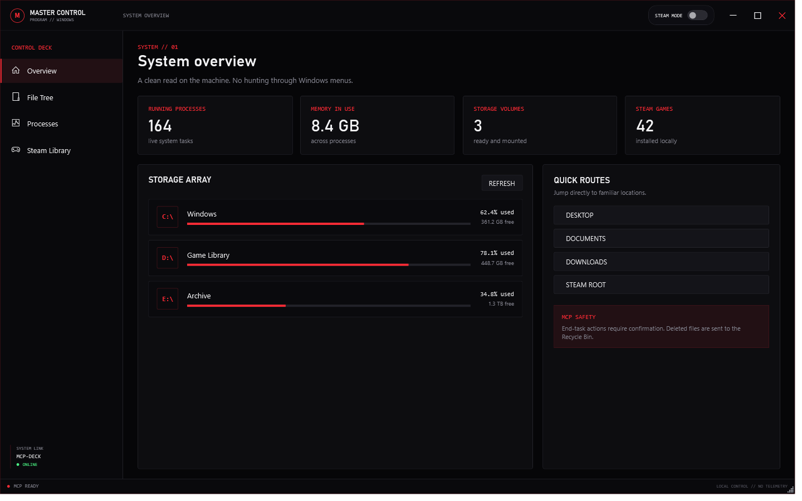
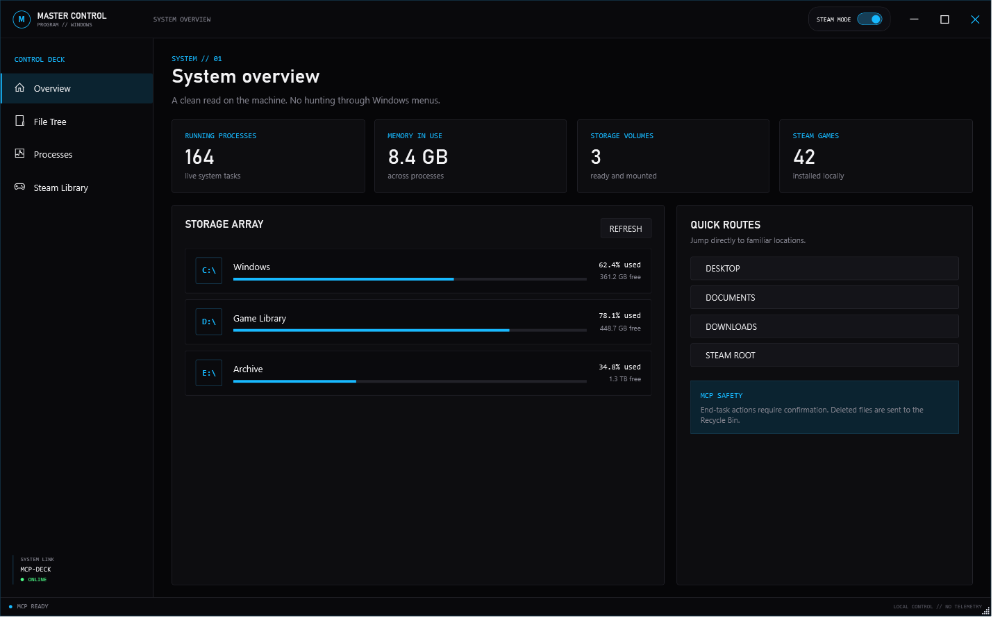

# Master Control Program

Master Control Program (MCP) is a lightweight Windows control deck for the things that should not require a hunt through five different system tools. It combines a task manager, file tree, storage overview, and Steam library analyzer in one clear desktop interface.

The standard interface uses a neon-red-on-black TRON aesthetic. When Steam is found, a **Steam Mode** switch appears at the top-right and shifts the entire control deck to neon blue.





## Run it

MCP is deliberately zero-install. It uses Windows PowerShell and WPF, which ship with Windows 10 and 11.

1. Download or clone this repository.
2. Double-click **`Launch-MCP.cmd`**.

Windows may show a SmartScreen prompt for files downloaded from the internet. Choose **More info → Run anyway** if you trust this repository. MCP does not require administrator access for normal use; protected processes and folders remain protected by Windows.

You can also launch it from a terminal:

```powershell
powershell.exe -NoLogo -NoProfile -ExecutionPolicy Bypass -STA -File .\MCP.ps1
```

## What it does

### System overview

- Live running-process and memory totals
- Mounted-volume capacity and free-space meters
- Quick routes to Desktop, Documents, Downloads, and Steam
- Steam availability and installed-game count

### File tree

- Browse every ready Windows volume in a lazy-loading directory tree
- Filter the current folder instantly
- Open files and folders, copy paths, create folders, and rename items
- Send unwanted files to the Windows Recycle Bin after confirmation

### Background processes

- Refreshes automatically every four seconds
- Shows process name, PID, CPU utilization, memory, thread count, start time, and description
- Filters by name, description, or PID
- Opens the executable location when Windows exposes it
- Ends a selected task only after confirmation; MCP refuses to terminate itself or protected system PIDs

### Steam storage

MCP discovers Steam through the Windows registry and common install locations. It parses `libraryfolders.vdf` and every local `appmanifest_*.acf`, including secondary Steam libraries.

For each installed game it reports:

- Core installation size
- Additional data in Workshop content, shader cache, compatibility-data, and per-account Steam userdata folders
- Combined on-disk footprint
- Library location and Steam App ID

Games can be opened in Explorer or launched through Steam directly from MCP. Steam analysis runs in an isolated background job so large Workshop libraries do not freeze the interface.

## Privacy and safety

- All inspection is local. MCP has no telemetry, account system, server, or network API.
- File deletion uses the Windows Recycle Bin, not permanent removal.
- Process termination and file recycling require confirmation.
- MCP follows the permissions of the Windows account that launched it.

## Project layout

```text
Launch-MCP.cmd                  Double-click launcher
MCP.ps1                         Guarded application entry point
src/App.xaml                    WPF interface and TRON theme
src/MasterControlProgram.ps1    UI behavior and Windows integration
src/Mcp.Core.psm1               Filesystem, process, drive, and Steam logic
tests/Test-Core.ps1             Dependency-free core smoke tests
```

## Test the core

```powershell
powershell.exe -NoProfile -ExecutionPolicy Bypass -File .\tests\Test-Core.ps1
```

## Requirements

- Windows 10 or Windows 11
- Windows PowerShell 5.1
- A Steam desktop installation is optional; Steam controls stay hidden when Steam is not detected

## License

MIT — see [LICENSE](LICENSE).
